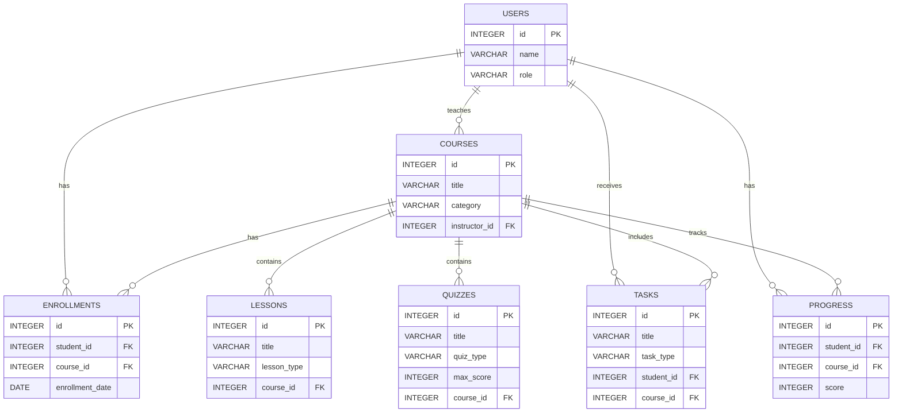

# Smart Study Planner

## 1. System Definition

### Object Types

1. User
2. Student
3. Instructor
4. Course
5. Lesson
6. VideoLesson
7. ReadingLesson
8. Quiz
9. MultipleChoiceQuiz
10. WrittenQuiz
11. Enrollment
12. Task
13. StudyTask
14. QuizTask
15. RevisionTask
16. Progress

### System Actions

1. Add user
2. Remove user
3. Add course
4. Remove course
5. Find course
6. Enroll student
7. Add lesson
8. Remove lesson
9. Create quiz
10. Solve quiz
11. Calculate quiz score
12. Add task
13. Remove task
14. View courses
15. View student progress
16. Sort courses
17. View categories

## 2. Java Implementation

The application is implemented in Java using OOP principles.

### Encapsulation

Model classes use encapsulated fields and public methods for controlled access to data.

### Collections

The service layer uses multiple collection types:

- `List<Course>`
- `Map<Integer, User>`
- `Set<String>`
- `TreeSet<Course>`

`TreeSet<Course>` is the sorted collection.

### Inheritance

The project uses inheritance for additional model classes:

- `Student extends User`
- `Instructor extends User`
- `StudyTask extends Task`
- `QuizTask extends Task`
- `RevisionTask extends Task`
- `VideoLesson extends Lesson`
- `ReadingLesson extends Lesson`
- `MultipleChoiceQuiz extends Quiz`
- `WrittenQuiz extends Quiz`

### Interface

The project defines the `Trackable` interface.

```java
public interface Trackable {
    void showProgress();
}
```

`Progress` implements `Trackable`.

### Custom Exception

The project defines and uses the custom exception:

```java
CourseNotFoundException
```

It is used when a course cannot be found.

### Service Class

The main service class is:

```java
ELearningService
```

### Main Class

The `Main` class calls the service methods and demonstrates the main system operations.

## 3. Database Persistence With JDBC

The application uses a relational SQL database and JDBC.

Database vendor:

```text
PostgreSQL
```

JDBC driver:

```text
postgresql-42.7.5
```

### Database Tables

The database model contains the following tables:

- `users`
- `courses`
- `lessons`
- `quizzes`
- `tasks`
- `enrollments`
- `progress`

### Table Relationships

- `courses.instructor_id` references `users.id`
- `lessons.course_id` references `courses.id`
- `quizzes.course_id` references `courses.id`
- `tasks.student_id` references `users.id`
- `tasks.course_id` references `courses.id`
- `enrollments.student_id` references `users.id`
- `enrollments.course_id` references `courses.id`
- `progress.student_id` references `users.id`
- `progress.course_id` references `courses.id`

## ERD



### CRUD Services

The project defines a generic CRUD interface:

```java
CrudRepository<T>
```

The project also defines a generic base repository:

```java
GenericRepository<T>
```

CRUD operations are implemented for at least six object types:

1. `UserRepository`
2. `CourseRepository`
3. `LessonRepository`
4. `QuizRepository`
5. `TaskRepository`
6. `ProgressRepository`

Each repository exposes create, read, update and delete operations.

## 4. Audit Service

The project includes an audit service:

```java
AuditService
```

The audit service writes each executed system action to a CSV file.

CSV file:

```text
audit.csv
```

CSV format:

```text
action_name,timestamp
```

## 5. Design Patterns

The project implements at least three design patterns.

### Singleton

Used for:

- `DatabaseConnection`
- `AuditService`
- repositories

### Builder

Used for:

- `Course.Builder`

### Factory

Used for:

- `UserFactory`

## 6. Graphical User Interface

The graphical interface is implemented with JavaFX.

GUI class:

```java
SmartStudyPlannerFX
```

Required components:

- one window: `Stage`
- one menu: `MenuBar`
- at least two menu items: `Refresh`, `Exit`
- one list: `ListView`
- one form: `TextField` and `Button`
